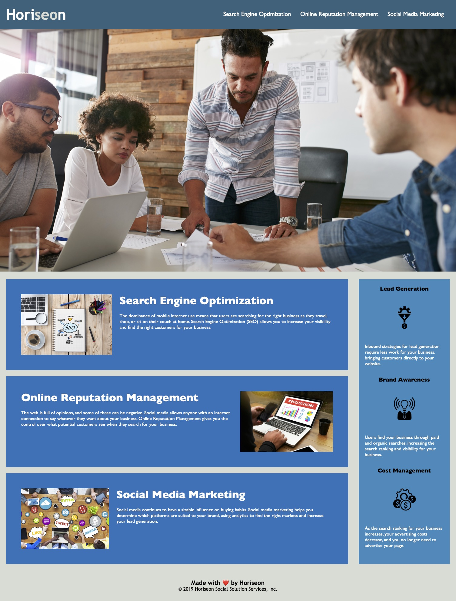

# <Horiseon business solutions website refactor>

## Description

The aim of this webpage is to give users a clear overview of what Horiseon offers. It sets out the three main services on offer and three of the main benefits. It is visually pleasing with photos and icons along the text. The branding is clear through the use of colour and font.

The refactor involved:
    - cleaning up the html and css files for readability and future use.
    - improving accessibility by using HTML semantic elements as much as possible, providing descriptions for all images and labelling the differents elements clearly to aid navigation.
    - optimising the website for search engines through the language elements, the metadata provided in the head and the naming of the different elements.

## Installation

n/a

## Usage

The webpage has a header with a navigation menu of three items at the top, which link to the sections below. There is a clear section for each of the three items that represent the three main services offered by the company. On the right, there is a side bar defining three of the main benefits of using the company's services. At the bottom is the company signature.

## License

This project is MIT licensed.